## 1 Mybatis-Plus简介

### 1.1 简介

​	MyBatis-Plus（简称 MP）是一个 MyBatis 的增强工具，在 MyBatis 的基础上只做增强不做改变，为简化开发、提高效率而生。该框架由baomidou（苞米豆）组织开发并且开源的。官网：<https://mybatis.plus/>  或 <https://mp.baomidou.com/>，码云地址：<https://gitee.com/organizations/baomidou>


**愿景**

我们的愿景是成为 MyBatis 最好的搭档，就像魂斗罗 中的 1P、2P，基友搭配，效率翻倍。


### 1.2 特性

- **无侵入**：只做增强不做改变，引入它不会对现有工程产生影响，如丝般顺滑
- **损耗小**：启动即会自动注入基本 CURD，性能基本无损耗，直接面向对象操作
- **强大的 CRUD 操作**：内置通用 Mapper、通用 Service，仅仅通过少量配置即可实现单表大部分 CRUD 操作，更有强大的条件构造器，满足各类使用需求
- **支持 Lambda 形式调用**：通过 Lambda 表达式，方便的编写各类查询条件，无需再担心字段写错
- **支持多种数据库**：支持 MySQL、MariaDB、Oracle、DB2、H2、HSQL、SQLite、Postgre、SQLServer2005、SQLServer 等多种数据库
- **支持主键自动生成**：支持多达 4 种主键策略（内含分布式唯一 ID 生成器 - Sequence），可自由配置，完美解决主键问题
- **支持 XML 热加载**：Mapper 对应的 XML 支持热加载，对于简单的 CRUD 操作，甚至可以无 XML 启动
- **支持 ActiveRecord 模式**：支持 ActiveRecord 形式调用，实体类只需继承 Model 类即可进行强大的 CRUD 操作
- **支持自定义全局通用操作**：支持全局通用方法注入（ Write once, use anywhere ）
- **支持关键词自动转义**：支持数据库关键词（order、key......）自动转义，还可自定义关键词
- **内置代码生成器**：采用代码或者 Maven 插件可快速生成 Mapper 、 Model 、 Service 、 Controller 层代码，支持模板引擎，更有超多自定义配置等您来使用
- **内置分页插件**：基于 MyBatis 物理分页，开发者无需关心具体操作，配置好插件之后，写分页等同于普通 List 查询
- **内置性能分析插件**：可输出 Sql 语句以及其执行时间，建议开发测试时启用该功能，能快速揪出慢查询
- **内置全局拦截插件**：提供全表 delete 、update 操作智能分析阻断，也可自定义拦截规则，预防误操作
- **内置 Sql 注入剥离器**：支持 Sql 注入剥离，有效预防 Sql 注入攻击


## 2 快速入门

### 2.1 创建数据库及表

 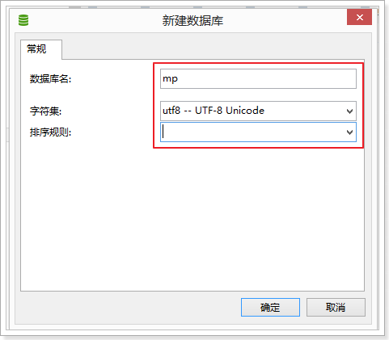

~~~sql
-- 创建测试表
CREATE TABLE `tb_user` (
  `id` bigint(20) NOT NULL AUTO_INCREMENT COMMENT '主键ID',
  `user_name` varchar(20) NOT NULL COMMENT '用户名',
  `password` varchar(20) NOT NULL COMMENT '密码',
  `name` varchar(30) DEFAULT NULL COMMENT '姓名',
  `age` int(11) DEFAULT NULL COMMENT '年龄',
  `email` varchar(50) DEFAULT NULL COMMENT '邮箱',
  PRIMARY KEY (`id`)
) ENGINE=InnoDB AUTO_INCREMENT=1 DEFAULT CHARSET=utf8;

-- 插入测试数据
INSERT INTO `tb_user` (`id`, `user_name`, `password`, `name`, `age`, `email`) VALUES ('1', 'zhangsan', '123456', '张三', '18', 'test1@itcast.cn');
INSERT INTO `tb_user` (`id`, `user_name`, `password`, `name`, `age`, `email`) VALUES ('2', 'lisi', '123456', '李四', '20', 'test2@itcast.cn');
INSERT INTO `tb_user` (`id`, `user_name`, `password`, `name`, `age`, `email`) VALUES ('3', 'wangwu', '123456', '王五', '28', 'test3@itcast.cn');
INSERT INTO `tb_user` (`id`, `user_name`, `password`, `name`, `age`, `email`) VALUES ('4', 'zhaoliu', '123456', '赵六', '21', 'test4@itcast.cn');
INSERT INTO `tb_user` (`id`, `user_name`, `password`, `name`, `age`, `email`) VALUES ('5', 'sunqi', '123456', '孙七', '24', 'test5@itcast.cn');
~~~


### 2.2 工程搭建

#### 2.2.1 创建springBoot工程

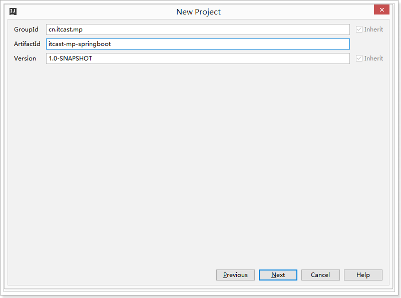

#### 2.2.2 导入依赖

~~~xml
<?xml version="1.0" encoding="UTF-8"?>
<project xmlns="http://maven.apache.org/POM/4.0.0"
         xmlns:xsi="http://www.w3.org/2001/XMLSchema-instance"
         xsi:schemaLocation="http://maven.apache.org/POM/4.0.0 http://maven.apache.org/xsd/maven-4.0.0.xsd">
    <modelVersion>4.0.0</modelVersion>

    <parent>
        <groupId>org.springframework.boot</groupId>
        <artifactId>spring-boot-starter-parent</artifactId>
        <version>2.1.4.RELEASE</version>
    </parent>

    <groupId>cn.itcast.mp</groupId>
    <artifactId>itcast-mp-springboot</artifactId>
    <version>1.0-SNAPSHOT</version>

    <dependencies>
        <dependency>
            <groupId>org.springframework.boot</groupId>
            <artifactId>spring-boot-starter</artifactId>
            <exclusions>
                <exclusion>
                    <groupId>org.springframework.boot</groupId>
                    <artifactId>spring-boot-starter-logging</artifactId>
                </exclusion>
            </exclusions>
        </dependency>
        <dependency>
            <groupId>org.springframework.boot</groupId>
            <artifactId>spring-boot-starter-test</artifactId>
            <scope>test</scope>
        </dependency>

        <!--简化代码的工具包-->
        <dependency>
            <groupId>org.projectlombok</groupId>
            <artifactId>lombok</artifactId>
            <optional>true</optional>
        </dependency>
        <!--mybatis-plus的springboot支持-->
        <dependency>
            <groupId>com.baomidou</groupId>
            <artifactId>mybatis-plus-boot-starter</artifactId>
            <version>3.1.1</version>
        </dependency>
        <!--mysql驱动-->
        <dependency>
            <groupId>mysql</groupId>
            <artifactId>mysql-connector-java</artifactId>
            <version>5.1.47</version>
        </dependency>
        <dependency>
            <groupId>org.slf4j</groupId>
            <artifactId>slf4j-log4j12</artifactId>
        </dependency>

    </dependencies>

    <build>
        <plugins>
            <plugin>
                <groupId>org.springframework.boot</groupId>
                <artifactId>spring-boot-maven-plugin</artifactId>
            </plugin>
        </plugins>
    </build>

</project>
~~~

log4j.properties：

```properties
log4j.rootLogger=DEBUG,A1

log4j.appender.A1=org.apache.log4j.ConsoleAppender
log4j.appender.A1.layout=org.apache.log4j.PatternLayout
log4j.appender.A1.layout.ConversionPattern=[%t] [%c]-[%p] %m%n
```

#### 2.2.3 配置application.properties

```properties
spring.application.name = itcast-mp-springboot

spring.datasource.driver-class-name=com.mysql.jdbc.Driver
spring.datasource.url=jdbc:mysql://127.0.0.1:3306/mp?useUnicode=true&characterEncoding=utf8&autoReconnect=true&allowMultiQueries=true&useSSL=false
spring.datasource.username=root
spring.datasource.password=123

# 设置Mapper接口所对应的XML文件位置，如果你在Mapper接口中有自定义方法，需要进行该配置
mybatis-plus.mapper-locations = classpath*:mybatis/*.xml
# 设置别名包扫描路径，通过该属性可以给包中的类注册别名
mybatis-plus.type-aliases-package = cn.itcast.mp.pojo
```

#### 2.2.4 编写pojo

```java
package cn.itcast.mp.pojo;

import com.baomidou.mybatisplus.annotation.TableName;
import lombok.AllArgsConstructor;
import lombok.Data;
import lombok.NoArgsConstructor;

@Data
@NoArgsConstructor
@AllArgsConstructor
@TableName("tb_user")
public class User {
    @TableId("ID")
    private Long id;
    @TableField("USER_NAME") 
    private String userName; //驼峰命名,则无需注解
    @TableField("PASSWORD")
    private String password;
    @TableField("NAME")
    private String name;
    @TableField("AGE")
    private Integer age;
    @TableField("EMAIL")
    private String email;
}
```

#### 2.2.5 编写mapper接口和配置文件

~~~java
package cn.itcast.mp.mapper;

import cn.itcast.mp.pojo.User;
import com.baomidou.mybatisplus.core.mapper.BaseMapper;

public interface UserMapper extends BaseMapper<User> {
}
~~~

在resources目录下新建一个文件夹mybatis，专门存放mapper配置文件

```xml
<?xml version="1.0" encoding="UTF-8" ?>
<!DOCTYPE mapper
        PUBLIC "-//mybatis.org//DTD Mapper 3.0//EN"
        "http://mybatis.org/dtd/mybatis-3-mapper.dtd">
<mapper namespace="cn.itcast.mp.mapper.UserMapper">
    
</mapper>
```

#### 2.2.6 修改启动类

```java
package cn.itcast.mp;

import org.mybatis.spring.annotation.MapperScan;
import org.springframework.boot.SpringApplication;
import org.springframework.boot.WebApplicationType;
import org.springframework.boot.autoconfigure.SpringBootApplication;
import org.springframework.boot.builder.SpringApplicationBuilder;

@MapperScan("cn.itcast.mp.mapper") //设置mapper接口的扫描包
@SpringBootApplication
public class MyApplication {
    public static void main(String[] args) {
        SpringApplication.run(MyApplication.class, args);
    }
}
```

#### 2.2.7 编写测试用例

```java
package cn.itcast.mp;

import cn.itcast.mp.mapper.UserMapper;
import cn.itcast.mp.pojo.User;
import org.junit.Test;
import org.junit.runner.RunWith;
import org.springframework.beans.factory.annotation.Autowired;
import org.springframework.boot.test.context.SpringBootTest;
import org.springframework.test.context.junit4.SpringRunner;

import java.util.List;

@RunWith(SpringRunner.class)
@SpringBootTest
public class TestMybatisSpringBoot {

    @Autowired
    private UserMapper userMapper;

    @Test
    public void testSelect() {
        //根据id查询数据
        User user = userMapper.selectById(2L);
        System.out.println(user);
    }

}
```

测试结果：

~~~shell
[main] [cn.itcast.mp.mapper.UserMapper.selectById]-[DEBUG] ==>  Preparing: SELECT id,user_name,password,name,age,email FROM tb_user WHERE id=? 
[main] [cn.itcast.mp.mapper.UserMapper.selectById]-[DEBUG] ==> Parameters: 2(Long)
[main] [cn.itcast.mp.mapper.UserMapper.selectById]-[DEBUG] <==      Total: 1

result = User(id=2, userName=lisi, password=123456, name=李四, age=20, email=test2@itcast.cn, address=null)
~~~


## 3 通用CRUD

​	在入门案例中，我们的Mapper接口继承了BaseMapper，然后就可以进行到各种各样的单表操作，接下来我们将详细讲解这些操作。

 

### 3.1 插入操作

#### 3.1.1 insert方法

~~~java
/**
 * 插入一条记录
 * @param entity 实体对象
*/
int insert(T entity);
~~~

#### 3.1.2 测试用例

```java
package cn.itcast.mp;

import cn.itcast.mp.mapper.UserMapper;
import cn.itcast.mp.pojo.User;
import org.junit.Test;
import org.junit.runner.RunWith;
import org.springframework.beans.factory.annotation.Autowired;
import org.springframework.boot.test.context.SpringBootTest;
import org.springframework.test.context.junit4.SpringRunner;

import java.util.List;

@RunWith(SpringRunner.class)
@SpringBootTest
public class TestUserMapper {

    @Autowired
    private UserMapper userMapper;

    @Test
    public void testInsert(){
        User user = new User();
        user.setEmail("123@itcast.cn");
        user.setAge(301);
        user.setUserName("caocao");
        user.setName("曹操");
        user.setPassword("123456");

        //返回的result是受影响的行数，并不是自增后的id
        int result = userMapper.insert(user); 
        System.out.println("result = " + result); 

        //自增后的id会回填到对象中
        System.out.println(user.getId()); 
    }
}
```

测试结果：

~~~shell
[main] [cn.itcast.mp.mapper.UserMapper.insert]-[DEBUG] ==>  Preparing: INSERT INTO tb_user ( id, user_name, password, name, age, email ) VALUES ( ?, ?, ?, ?, ?, ? ) 
[main] [cn.itcast.mp.mapper.UserMapper.insert]-[DEBUG] ==> Parameters: 1122045867793072130(Long), caocao(String), 123456(String), 曹操(String), 20(Integer), test@itcast.cn(String)
[main] [cn.itcast.mp.mapper.UserMapper.insert]-[DEBUG] <==    Updates: 1
[main] [org.mybatis.spring.SqlSessionUtils]-[DEBUG] Closing non transactional SqlSession [org.apache.ibatis.session.defaults.DefaultSqlSession@411291e5]
result = 1
1122045867793072130
~~~

 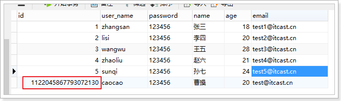

#### 3.1.3 主键生成策略

​	在刚才的例子中，数据已经保存到了数据库，但是id的值不是我们期望的自增长，而是MP生成了id的值并写入到了数据库。我们也可以通过IdType类自己设置id的生成策略。

~~~java
package com.baomidou.mybatisplus.annotation;
import lombok.Getter;

/**
 * 生成ID类型枚举类
 */
@Getter
public enum IdType {
    /**
     * 数据库ID自增
     */
    AUTO(0),
    /**
     * 该类型为未设置主键类型，这是默认值
     */
    NONE(1),
    /**
     * 用户输入ID
     * <p>该类型可以通过自己注册自动填充插件进行填充</p>
     */
    INPUT(2),

    /* 以下3种类型、只有当插入对象ID为空，才自动填充。 */
    /**
     * 全局唯一ID (idWorker)
     */
    ID_WORKER(3),
    /**
     * 全局唯一ID (UUID)
     */
    UUID(4),
    /**
     * 字符串全局唯一ID (idWorker的字符串表示)
     */
    ID_WORKER_STR(5);

    private final int key;

    IdType(int key) {
        this.key = key;
    }
}

~~~

修改User对象，设置id为自增长：

~~~java
package cn.itcast.mp.pojo;

import com.baomidou.mybatisplus.annotation.IdType;
import com.baomidou.mybatisplus.annotation.TableId;
import com.baomidou.mybatisplus.annotation.TableName;
import lombok.AllArgsConstructor;
import lombok.Data;
import lombok.NoArgsConstructor;

@Data
@NoArgsConstructor
@AllArgsConstructor
@TableName("tb_user")
public class User {

    @TableId(type = IdType.AUTO) //指定id为自增长
    private Long id;
    ... ...
}
~~~

数据插入成功：

 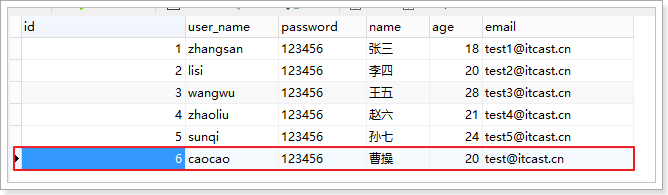


### 3.2 更新操作

#### 3.2.1 updateById方法

~~~java
/**
 * 根据ID修改
 * @param entity 实体对象
 */
int updateById(@Param(Constants.ENTITY) T entity);
~~~

####　3.2.2 测试用例

~~~java
@RunWith(SpringRunner.class)
@SpringBootTest
public class TestUserMapper {

    @Autowired
    private UserMapper userMapper;

    @Test
    public void testUpdateById() {
        User user = new User();
        user.setId(6L); //主键
        user.setAge(21); //更新的字段

        //根据id更新，更新不为null的字段
        this.userMapper.updateById(user);
    }

}
~~~

测试结果：

~~~shell
[main] [cn.itcast.mp.mapper.UserMapper.updateById]-[DEBUG] ==>  Preparing: UPDATE tb_user SET age=? WHERE id=? 
[main] [cn.itcast.mp.mapper.UserMapper.updateById]-[DEBUG] ==> Parameters: 21(Integer), 6(Long)
[main] [cn.itcast.mp.mapper.UserMapper.updateById]-[DEBUG] <==    Updates: 1
~~~

 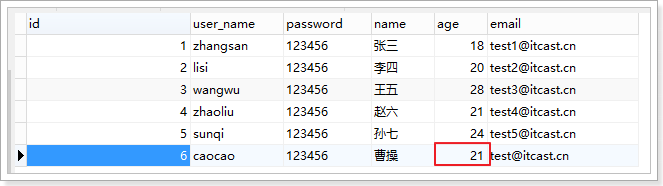


### 3.3 删除操作

#### 3.3.1 deleteById

```java
/**
 * 根据 ID 删除
 * @param id 主键ID
 */
int deleteById(Serializable id);
```

#### 3.3.2 测试用例

~~~java
package cn.itcast.mp;

import cn.itcast.mp.mapper.UserMapper;
import org.junit.Test;
import org.junit.runner.RunWith;
import org.springframework.beans.factory.annotation.Autowired;
import org.springframework.boot.test.context.SpringBootTest;
import org.springframework.test.context.junit4.SpringRunner;

@RunWith(SpringRunner.class)
@SpringBootTest
public class TestUserMapper {

    @Autowired
    private UserMapper userMapper;

    @Test
    public void testDeleteById() {
        //执行删除操作
        int result = this.userMapper.deleteById(6L);
        System.out.println("result = " + result);
    }
}
~~~

测试结果：

~~~shell
[main] [cn.itcast.mp.mapper.UserMapper.deleteById]-[DEBUG] ==>  Preparing: DELETE FROM tb_user WHERE id=? 
[main] [cn.itcast.mp.mapper.UserMapper.deleteById]-[DEBUG] ==> Parameters: 6(Long)
[main] [cn.itcast.mp.mapper.UserMapper.deleteById]-[DEBUG] <==    Updates: 1
~~~

 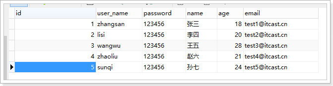


### 3.4 查询操作

MP提供了多种查询操作，包括根据id查询、批量查询、查询单条数据、查询列表、分页查询等操作。

#### 3.4.1 selectById

~~~java
/**
 * 根据ID查询
 * @param id 主键ID
 */
T selectById(Serializable id);
~~~

#### 3.4.2 测试用例

~~~java
package cn.itcast.mp;

import cn.itcast.mp.mapper.UserMapper;
import cn.itcast.mp.pojo.User;
import org.junit.Test;
import org.junit.runner.RunWith;
import org.springframework.beans.factory.annotation.Autowired;
import org.springframework.boot.test.context.SpringBootTest;
import org.springframework.test.context.junit4.SpringRunner;

@RunWith(SpringRunner.class)
@SpringBootTest
public class TestUserMapper {

    @Autowired
    private UserMapper userMapper;

    @Test
    public void testSelectById() {
        //根据id查询数据
        User user = this.userMapper.selectById(2L);
        System.out.println("result = " + user);
    }
}
~~~

测试结果：

~~~shell
[main] [cn.itcast.mp.mapper.UserMapper.selectById]-[DEBUG] ==>  Preparing: SELECT id,user_name,password,name,age,email FROM tb_user WHERE id=? 
[main] [cn.itcast.mp.mapper.UserMapper.selectById]-[DEBUG] ==> Parameters: 2(Long)
[main] [cn.itcast.mp.mapper.UserMapper.selectById]-[DEBUG] <==      Total: 1

result = User(id=2, userName=lisi, password=123456, name=李四, age=20, email=test2@itcast.cn, address=null)
~~~


## 4 条件构造器

​	在增删改查中，最复杂的就是带有各种条件的操作。在MP中，专门针对sql条件进行了封装，提供了各种Wrapper接口及其实现类。XxxWrapper类提供了各种方法来封装sql条件。

 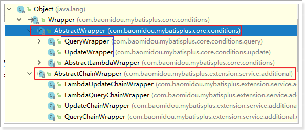

MP提供了各种方法用来支持带有条件的查询方法、修改方法和删除方法：

```java
/**
根据 entity 条件，查询一条记录
@param queryWrapper 实体对象封装操作类（可以为null）
*/
T selectOne(@Param(Constants.WRAPPER) Wrapper<T> queryWrapper);

/**
根据 Wrapper 条件，查询总记录数
@param queryWrapper 实体对象封装操作类（可以为null）
*/
Integer selectCount(@Param(Constants.WRAPPER) Wrapper<T> queryWrapper);

/**
根据 entity 条件，查询全部记录
@param queryWrapper 实体对象封装操作类（可以为null）
*/
List<T> selectList(@Param(Constants.WRAPPER) Wrapper<T> queryWrapper);
```

下面我们以查询方法为例学习条件构造器的具体用法。


### 4.1 比较操作

- eq
  - 等于 =
- ne
  - 不等于 <>
- gt
  - 大于 >
- ge
  - 大于等于 >=
- lt
  - 小于 <
- le
  - 小于等于 <=
- between
  - BETWEEN 值1 AND 值2
- notBetween
  - NOT BETWEEN 值1 AND 值2
- in
  - 字段 IN (value.get(0), value.get(1), ...)
- notIn
  - 字段 NOT IN (v0, v1, ...)

测试用例：

~~~java
package cn.itcast.mp;

import cn.itcast.mp.mapper.UserMapper;
import cn.itcast.mp.pojo.User;
import com.baomidou.mybatisplus.core.conditions.query.QueryWrapper;
import org.junit.Test;
import org.junit.runner.RunWith;
import org.springframework.beans.factory.annotation.Autowired;
import org.springframework.boot.test.context.SpringBootTest;
import org.springframework.test.context.junit4.SpringRunner;

import java.util.List;

@RunWith(SpringRunner.class)
@SpringBootTest
public class UserMapperTest {

    @Autowired
    private UserMapper userMapper;

    @Test
    public void testEq() {
        QueryWrapper<User> wrapper = new QueryWrapper<>();

        //SELECT id,user_name,password,name,age,email FROM tb_user WHERE 
        //password = ? AND age >= ? AND name IN (?,?,?)
        wrapper.eq("password", "123456")
               .ge("age", 20)
               .in("name", "李四", "王五", "赵六");

        List<User> users = this.userMapper.selectList(wrapper);
        for (User user : users) {
            System.out.println(user);
        }
    }
}
~~~

### 4.2 模糊查询

- like
  - LIKE '%值%'
  - 例: `like("name", "王")`--->`name like '%王%'`
- notLike
  - NOT LIKE '%值%'
  - 例: `notLike("name", "王")`--->`name not like '%王%'`
- likeLeft
  - LIKE '%值'
  - 例: `likeLeft("name", "王")`--->`name like '%王'`
- likeRight
  - LIKE '值%'
  - 例: `likeRight("name", "王")`--->`name like '王%'`

测试用例：

~~~java
package cn.itcast.mp;

import cn.itcast.mp.mapper.UserMapper;
import cn.itcast.mp.pojo.User;
import com.baomidou.mybatisplus.core.conditions.query.QueryWrapper;
import org.junit.Test;
import org.junit.runner.RunWith;
import org.springframework.beans.factory.annotation.Autowired;
import org.springframework.boot.test.context.SpringBootTest;
import org.springframework.test.context.junit4.SpringRunner;

import java.util.List;

@RunWith(SpringRunner.class)
@SpringBootTest
public class UserMapperTest {

    @Autowired
    private UserMapper userMapper;

    @Test
    public void testLike() {
        QueryWrapper<User> wrapper = new QueryWrapper<>();

        //SELECT id,user_name,password,name,age,email FROM tb_user WHERE name LIKE ?
        //Parameters: %曹%(String)
        wrapper.like("name", "曹");

        List<User> users = this.userMapper.selectList(wrapper);
        for (User user : users) {
            System.out.println(user);
        }
    }
}
~~~

### 4.3 排序

- orderBy
  - 排序：ORDER BY 字段, ...
  - 例: `orderBy(true, true, "id", "name")`--->`order by id ASC,name ASC`
- orderByAsc
  - 排序：ORDER BY 字段, ... ASC
  - 例: `orderByAsc("id", "name")`--->`order by id ASC,name ASC`
- orderByDesc
  - 排序：ORDER BY 字段, ... DESC
  - 例: `orderByDesc("id", "name")`--->`order by id DESC,name DESC`

测试用例：

~~~java
package cn.itcast.mp;

import cn.itcast.mp.mapper.UserMapper;
import cn.itcast.mp.pojo.User;
import com.baomidou.mybatisplus.core.conditions.query.QueryWrapper;
import org.junit.Test;
import org.junit.runner.RunWith;
import org.springframework.beans.factory.annotation.Autowired;
import org.springframework.boot.test.context.SpringBootTest;
import org.springframework.test.context.junit4.SpringRunner;

import java.util.List;

@RunWith(SpringRunner.class)
@SpringBootTest
public class UserMapperTest {

    @Autowired
    private UserMapper userMapper;

    @Test
    public void testOrderByAgeDesc() {
        QueryWrapper<User> wrapper = new QueryWrapper<>();

        //SELECT id,user_name,password,name,age,email FROM tb_user ORDER BY age DESC
        wrapper.orderByDesc("age");

        List<User> users = this.userMapper.selectList(wrapper);
        for (User user : users) {
            System.out.println(user);
        }
    }
}
~~~

### 4.4 逻辑查询

- or
  - 拼接 OR
  - 主动调用`or`表示紧接着下一个**方法**不是用`and`连接!(不调用`or`则默认为使用`and`连接)
- and
  - AND 嵌套
  - 例: `and(i -> i.eq("name", "李白").ne("status", "活着"))`--->`and (name = '李白' and status <> '活着')`

测试用例：

```java
package cn.itcast.mp;

import cn.itcast.mp.mapper.UserMapper;
import cn.itcast.mp.pojo.User;
import com.baomidou.mybatisplus.core.conditions.query.QueryWrapper;
import org.junit.Test;
import org.junit.runner.RunWith;
import org.springframework.beans.factory.annotation.Autowired;
import org.springframework.boot.test.context.SpringBootTest;
import org.springframework.test.context.junit4.SpringRunner;

import java.util.List;

@RunWith(SpringRunner.class)
@SpringBootTest
public class UserMapperTest {

    @Autowired
    private UserMapper userMapper;

    @Test
    public void testOr() {
        QueryWrapper<User> wrapper = new QueryWrapper<>();

        //SELECT id,user_name,password,name,age,email FROM tb_user WHERE 
        //name = ? OR age = ?
        wrapper.eq("name","李四").or().eq("age", 24);

        List<User> users = this.userMapper.selectList(wrapper);
        for (User user : users) {
            System.out.println(user);
        }
    }
}
```

### 4.5 分页查询

selectPage方法：

```java
/**
 * 根据 entity 条件，查询全部记录（并翻页）
 * @param page         分页查询条件（可以为 RowBounds.DEFAULT）
 * @param queryWrapper 实体对象封装操作类（可以为 null）
 */
IPage<T> selectPage(IPage<T> page, @Param(Constants.WRAPPER) Wrapper<T> queryWrapper);
```

配置分页插件：

```java
package cn.itcast.mp;

import com.baomidou.mybatisplus.extension.plugins.PaginationInterceptor;
import org.mybatis.spring.annotation.MapperScan;
import org.springframework.context.annotation.Bean;
import org.springframework.context.annotation.Configuration;

@Configuration
@MapperScan("cn.itcast.mp.mapper") //设置mapper接口的扫描包
public class MybatisPlusConfig {

    /**
     * 分页插件
     */
    @Bean
    public PaginationInterceptor paginationInterceptor() {
        return new PaginationInterceptor();
    }
}
```

测试用例：

```java
package cn.itcast.mp;

import cn.itcast.mp.mapper.UserMapper;
import cn.itcast.mp.pojo.User;
import com.baomidou.mybatisplus.core.conditions.query.QueryWrapper;
import com.baomidou.mybatisplus.core.metadata.IPage;
import com.baomidou.mybatisplus.extension.plugins.pagination.Page;
import org.junit.Test;
import org.junit.runner.RunWith;
import org.springframework.beans.factory.annotation.Autowired;
import org.springframework.boot.test.context.SpringBootTest;
import org.springframework.test.context.junit4.SpringRunner;

import java.util.List;

@RunWith(SpringRunner.class)
@SpringBootTest
public class TestUserMapper {

    @Autowired
    private UserMapper userMapper;

    @Test
    public void testSelectPage() {
        QueryWrapper<User> wrapper = new QueryWrapper<User>();
        wrapper.gt("age", 20); //年龄大于20岁

        Page<User> page = new Page<>(1,1);

        //根据条件查询数据
        IPage<User> iPage = this.userMapper.selectPage(page, wrapper);
        System.out.println("数据总条数：" + iPage.getTotal());
        System.out.println("总页数：" + iPage.getPages());

        List<User> users = iPage.getRecords();
        for (User user : users) {
            System.out.println("user = " + user);
        }
    }
}
```

测试结果：

```shell
[main] [cn.itcast.mp.mapper.UserMapper.selectPage]-[DEBUG] ==>  Preparing: SELECT COUNT(1) FROM tb_user WHERE age > ? 
[main] [cn.itcast.mp.mapper.UserMapper.selectPage]-[DEBUG] ==> Parameters: 20(Integer)
[main] [cn.itcast.mp.mapper.UserMapper.selectPage]-[DEBUG] ==>  Preparing: SELECT id,user_name,password,name,age,email FROM tb_user WHERE age > ? LIMIT ?,? 
[main] [cn.itcast.mp.mapper.UserMapper.selectPage]-[DEBUG] ==> Parameters: 20(Integer), 0(Long), 1(Long)
[main] [cn.itcast.mp.mapper.UserMapper.selectPage]-[DEBUG] <==      Total: 1
[main] [org.mybatis.spring.SqlSessionUtils]-[DEBUG] Closing non transactional SqlSession [org.apache.ibatis.session.defaults.DefaultSqlSession@6ecd665]
数据总条数：3
总页数：3
user = User(id=3, userName=wangwu, password=123456, name=王五, age=28, email=test3@itcast.cn, address=null)
```


### 4.6 修改和删除

​	前面都是以查询为例讲解条件构造器，那么在进行修改和删除操作时也可以带条件，和查询基本一样，这里不再讲解，后面用到时再说。

```java
/**
根据wrapper封装的条件进行更新操作
*/
int delete(@Param("ew") Wrapper<T> wrapper);

/**
根据wrapper封装的条件进行删除操作
*/
int update(@Param("et") T entity, @Param("ew") Wrapper<T> updateWrapper);
```


## 5 Mybatis-Plus的Service封装 

​	Mybatis-Plus为了开发更加快捷，对业务层也进行了封装，直接提供了相关的接口和实现类。我们在进行业务层开发时，可以继承它提供的接口和实现类，使得编码更加高效。

1. com.baomidou.mybatisplus.extension.service.IService接口

   该接口是一个泛型接口，里面提供了很多方法，包括基本的增删改查。


2. com.baomidou.mybatisplus.extension.service.impl.ServiceImpl类

   该类实现了上面接口中的所有方法。

   

3. 测试用例

   1）自定义业务层接口，继承IService：

   ```java
   public interface UserService extends IService<User> {
   
   }
   ```

   2）自定义业务层实现类，继承ServiceImpl：

   ```java
   @Service
   public class UserServiceImpl extends ServiceImpl<UserMapper,User> implements UserService {
   
   }
   ```

   3）测试类：

   ```java
   @RunWith(SpringRunner.class)
   @SpringBootTest
   public class TestUserService {
       @Autowired
       private UserService userService;
   
       @Test
       public void testInsert() {
           User user = new User();
           user.setEmail("123@itcast.cn");
           user.setAge(301);
           user.setUserName("caocao1");
           user.setName("曹操1");
           user.setPassword("123456");
   
           userService.save(user);
   
           //获取自增长后的id值, 自增长后的id值会回填到user对象中
           System.out.println("id => " + user.getId());
       }
   
       @Test
       public void testSelectById() {
           User user = userService.getById(2);
           System.out.println(user);
       }
   
       @Test
       public void testUpdateById() {
           User user = new User();
           user.setId(1L); //条件，根据id更新
           user.setAge(19); //更新的字段
           user.setPassword("666666");
   
           userService.updateById(user);
       }
   
       @Test
       public void testDeleteById(){
           // 根据id删除数据
           userService.removeById(2L);
       }
   
   }
   ```


---------------------------------以下内容以了解为主，由大家自行学习---------------------------------

## 6 代码生成器

​	AutoGenerator 是 MyBatis-Plus 的代码生成器，通过 AutoGenerator 可以快速生成 Entity类、Mapper接口、Mapper XML、Service、Controller 等各个模块的代码，极大的提升了开发效率。

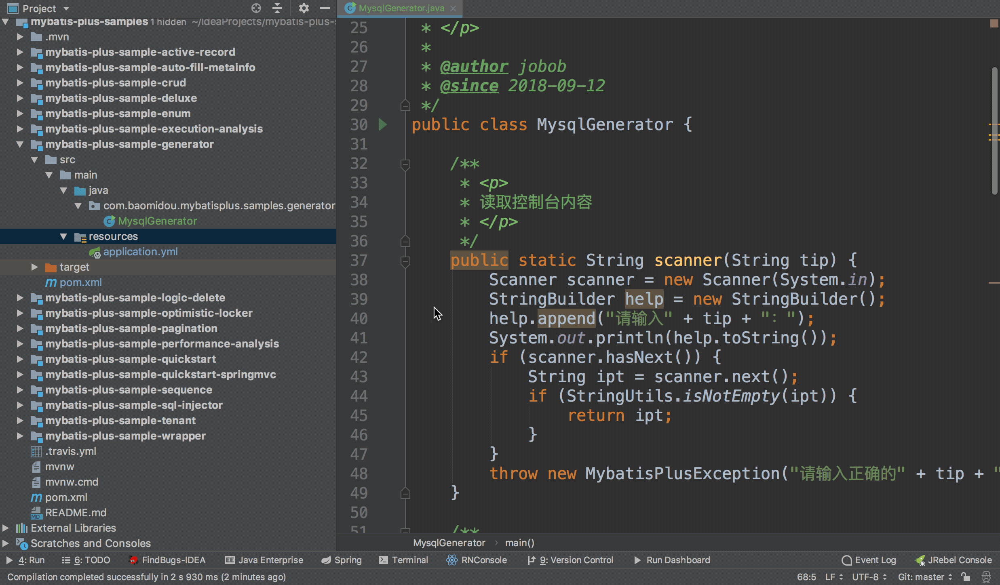

### 6.1 案例

1）在pom文件中引入依赖

```xml
<dependency>
    <groupId>com.baomidou</groupId>
    <artifactId>mybatis-plus-generator</artifactId>
    <version>3.1.2</version>
</dependency>
```

2）获取官方案例

```java
package cn.itcast.mp.generator;

import java.util.ArrayList;
import java.util.List;
import java.util.Scanner;

import com.baomidou.mybatisplus.core.exceptions.MybatisPlusException;
import com.baomidou.mybatisplus.core.toolkit.StringPool;
import com.baomidou.mybatisplus.core.toolkit.StringUtils;
import com.baomidou.mybatisplus.generator.AutoGenerator;
import com.baomidou.mybatisplus.generator.InjectionConfig;
import com.baomidou.mybatisplus.generator.config.DataSourceConfig;
import com.baomidou.mybatisplus.generator.config.FileOutConfig;
import com.baomidou.mybatisplus.generator.config.GlobalConfig;
import com.baomidou.mybatisplus.generator.config.PackageConfig;
import com.baomidou.mybatisplus.generator.config.StrategyConfig;
import com.baomidou.mybatisplus.generator.config.TemplateConfig;
import com.baomidou.mybatisplus.generator.config.po.TableInfo;
import com.baomidou.mybatisplus.generator.config.rules.NamingStrategy;
import com.baomidou.mybatisplus.generator.engine.FreemarkerTemplateEngine;

/**
 * <p>
 * 代码生成器演示例子
 * </p>
 */
public class MysqlGenerator {

    /**
     * <p>
     * 读取控制台内容
     * </p>
     */
    public static String scanner(String tip) {
        Scanner scanner = new Scanner(System.in);
        StringBuilder help = new StringBuilder();
        help.append("请输入" + tip + "：");
        System.out.println(help.toString());
        if (scanner.hasNext()) {
            String ipt = scanner.next();
            if (StringUtils.isNotEmpty(ipt)) {
                return ipt;
            }
        }
        throw new MybatisPlusException("请输入正确的" + tip + "！");
    }

    /**
     * RUN THIS
     */
    public static void main(String[] args) {
        // 代码生成器
        AutoGenerator mpg = new AutoGenerator();

        // 全局配置
        GlobalConfig gc = new GlobalConfig();
        String projectPath = System.getProperty("user.dir");
        gc.setOutputDir(projectPath + "/src/main/java");
        gc.setAuthor("itcast");
        gc.setOpen(false);
        mpg.setGlobalConfig(gc);

        // 数据源配置
        DataSourceConfig dsc = new DataSourceConfig();
        dsc.setUrl("jdbc:mysql://127.0.0.1:3306/mp?"+
                   "useUnicode=true&useSSL=false&characterEncoding=utf8");
        // dsc.setSchemaName("public");
        dsc.setDriverName("com.mysql.jdbc.Driver");
        dsc.setUsername("root");
        dsc.setPassword("123");
        mpg.setDataSource(dsc);

        // 包配置
        PackageConfig pc = new PackageConfig();
        pc.setModuleName(scanner("模块名"));
        pc.setParent("cn.itcast.mp.generator");
        mpg.setPackageInfo(pc);

        // 自定义配置
        InjectionConfig cfg = new InjectionConfig() {
            @Override
            public void initMap() {
                // to do nothing
            }
        };
        List<FileOutConfig> focList = new ArrayList<>();
        focList.add(new FileOutConfig("/templates/mapper.xml.ftl") {
            @Override
            public String outputFile(TableInfo tableInfo) {
                // 自定义输入文件名称
                return projectPath + "/itcast-mp-generator/src/main/resources/mapper/" + 
                    pc.getModuleName()  + "/" + tableInfo.getEntityName() + "Mapper" + 
                    StringPool.DOT_XML;
            }
        });
        cfg.setFileOutConfigList(focList);
        mpg.setCfg(cfg);
        mpg.setTemplate(new TemplateConfig().setXml(null));

        // 策略配置
        StrategyConfig strategy = new StrategyConfig();
        strategy.setNaming(NamingStrategy.underline_to_camel);
        strategy.setColumnNaming(NamingStrategy.underline_to_camel);
        strategy.setEntityLombokModel(true);
        strategy.setInclude(scanner("表名"));
        strategy.setSuperEntityColumns("id");
        strategy.setControllerMappingHyphenStyle(true);
        strategy.setTablePrefix(pc.getModuleName() + "_");
        mpg.setStrategy(strategy);
        mpg.execute();
    }

}
```

### 6.2 测试

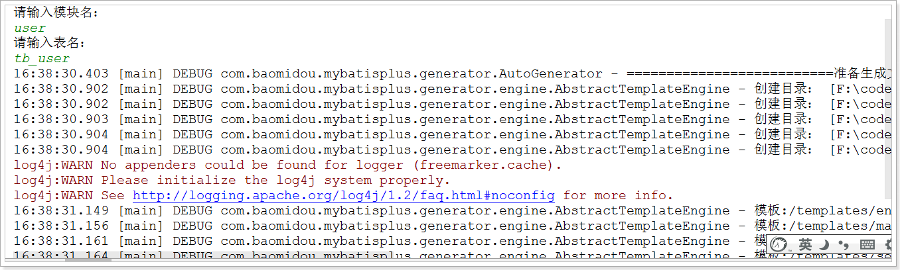

代码已生成：

 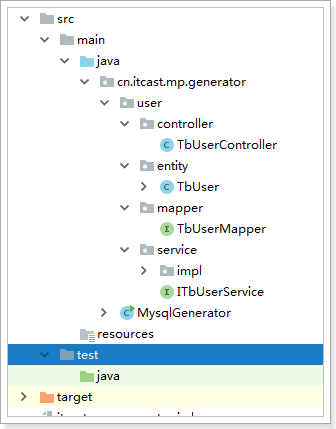


## 7 MybatisX 快速开发插件

MybatisX 是一款基于 IDEA 的快速开发插件，为效率而生。

安装方法：打开 IDEA，进入 File -> Settings -> Plugins -> Browse Repositories，输入 `mybatisx` 搜索并安装。

功能：

- Java 与 XML 调回跳转
- Mapper 方法自动生成 XML 

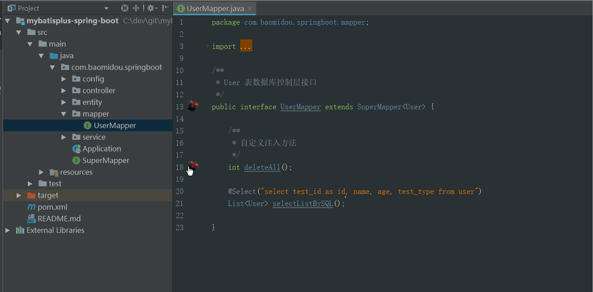

